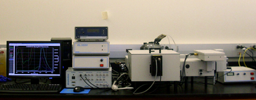
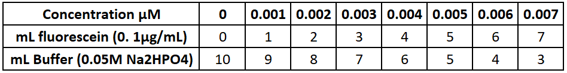
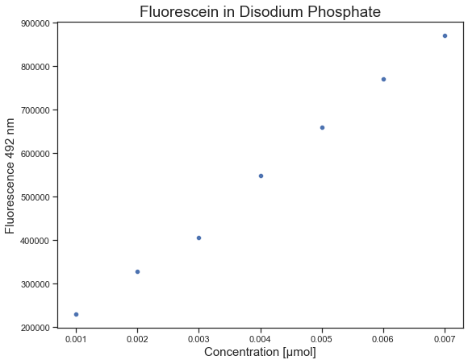
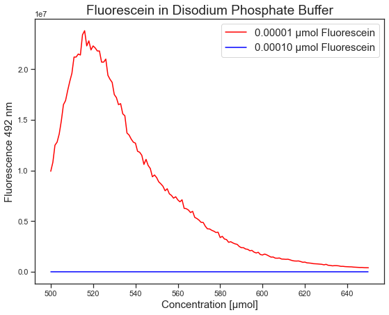
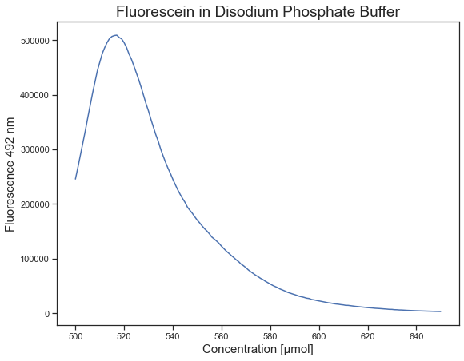
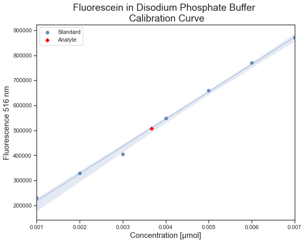

# Fluorescein Content in a Disodium Phosphate Buffer

##  Objective
The objective of this experiment was to determine the concentration of fluorescein dissolved in a 0.05M Disodium Phosphate Buffer. 
All data-collection efforts were performed in the Instrumentation Lab at the University of the Incarnate Word. The visualizations in this repository were created using Seaborn. Regression analysis  of the calibration curve was performed using scikit-learn.
### Python Libraries Used 
* Numpy
* Matplotlib
* Seaborn
* Scikit Learn

##  Instrumentation 
**Horiba PTI Quantamaster 4**

##  Calibration

##  Detection Limit

##   Analysis 

## Conclusion

Spectrofluorometric analysis was performed on a sample containing an unknown concentration of fluorescein in a 0.05 M disodium phosphate buffer. A linear regression model was created using seven fluorescein/buffer solutions of known concentration, and the Python scikit-learn library.  
* The R-Squared value for the regression analysis is 0.996   
* **The concentraion of fluorescein in the unknown sample is 0.004 μmol.**