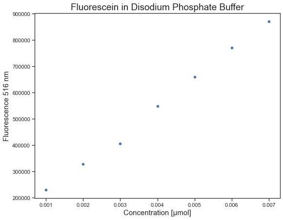

# Determination of Fluorescein Concentration in Disodium Phosphate

## :electric_plug: Instrumentation 

<b> Quantamaster 4</b>

<!-- 
 -->

## :bulb: Detection Limit

## :chart_with_upwards_trend: Calibration

##  :bar_chart: Determination of Fluorescein in Disodium Phosphate Buffer  